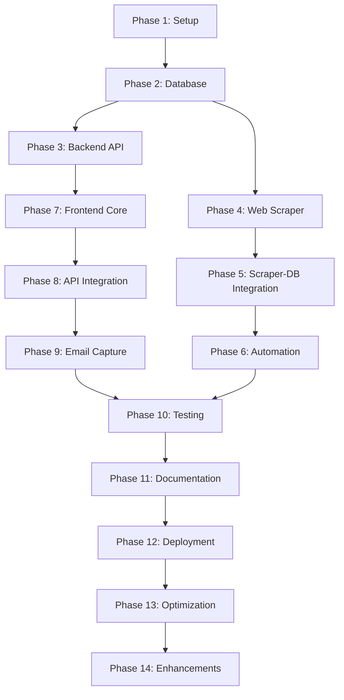

# Sydney Events Aggregator - Project Phases

## Overview
This document breaks down the Sydney Events Aggregator project into structured phases, allowing for systematic development and testing of each component.

---

## Phase 1: Project Setup & Environment Configuration
**Duration**: 1-2 days  
**Priority**: High

### Goals
- Set up development environment
- Initialize project structure
- Configure version control

### Tasks
- [ ] Create project directory structure
- [ ] Initialize Git repository
- [ ] Set up Python virtual environment for scraper
- [ ] Initialize Node.js projects for backend and frontend
- [ ] Create `.env` files for environment variables
- [ ] Install MongoDB locally or set up cloud instance (MongoDB Atlas)
- [ ] Document setup process in README.md

### Deliverables
- Complete directory structure as per project.md
- Working development environment
- Initial Git repository with .gitignore
- README.md with setup instructions

---

## Phase 2: Database Design & Setup
**Duration**: 1-2 days  
**Priority**: High

### Goals
- Design and implement database schema
- Create database models
- Test database connections

### Tasks
- [ ] Set up MongoDB connection
- [ ] Create Events schema/model
- [ ] Create Emails schema/model
- [ ] Add indexes for performance (event_id, date, is_active)
- [ ] Create seed data for testing
- [ ] Test CRUD operations

### Deliverables
- Working MongoDB instance
- Event.js and Email.js models
- Sample seed data
- Database connection utilities

---

## Phase 3: Backend API Development
**Duration**: 3-4 days  
**Priority**: High

### Goals
- Build REST API endpoints
- Implement business logic
- Add error handling and validation

### Tasks
- [ ] Set up Express.js server
- [ ] Configure CORS and middleware
- [ ] Implement GET /api/events endpoint
- [ ] Implement POST /api/subscribe endpoint
- [ ] Add input validation and sanitization
- [ ] Implement error handling middleware
- [ ] Add request logging
- [ ] Create API documentation

### Deliverables
- Working backend API server
- Complete API endpoints
- API documentation (api-docs.md)
- Postman/Thunder Client collection for testing

---

## Phase 4: Web Scraper Development
**Duration**: 4-5 days  
**Priority**: High

### Goals
- Build modular scraper for Sydney event websites
- Implement data extraction and cleaning
- Add duplicate detection

### Tasks
- [ ] Research target Sydney event websites
- [ ] Create base scraper class/utilities
- [ ] Implement scraper for first event source
- [ ] Build date parsing utilities
- [ ] Implement duplicate detection (hash-based)
- [ ] Create data normalization functions
- [ ] Add error handling for network issues
- [ ] Test scraper with real websites
- [ ] Create scraper for additional sources (2-3 sites)

### Deliverables
- Working scraper scripts
- Utility functions (date_parser.py, deduplicate.py)
- requirements.txt with dependencies
- Scraped data samples

---

## Phase 5: Scraper-Database Integration
**Duration**: 2-3 days  
**Priority**: High

### Goals
- Connect scraper to database
- Implement data insertion logic
- Handle updates and conflicts

### Tasks
- [ ] Create database connection in Python
- [ ] Implement data insertion logic
- [ ] Add update logic for existing events
- [ ] Mark expired events as inactive
- [ ] Add timestamp tracking
- [ ] Test full scraping pipeline
- [ ] Verify data integrity

### Deliverables
- Complete scraper-to-database pipeline
- Populated events collection
- Data validation scripts

---

## Phase 6: Automation Setup
**Duration**: 1-2 days  
**Priority**: Medium

### Goals
- Automate scraper execution
- Schedule periodic updates

### Tasks
- [ ] Implement node-cron or system cron job
- [ ] Set scraper schedule (every 6-12 hours)
- [ ] Add logging for scheduled runs
- [ ] Create monitoring script
- [ ] Test automated execution
- [ ] Add email alerts for failures (optional)

### Deliverables
- Automated scraper schedule
- Logging system
- Monitoring dashboard/script

---

## Phase 7: Frontend Development - Core UI
**Duration**: 4-5 days  
**Priority**: High

### Goals
- Build responsive event listing interface
- Implement event cards
- Create layout and styling

### Tasks
- [ ] Create HTML structure (index.html)
- [ ] Design responsive CSS layout
- [ ] Build EventCard component
- [ ] Implement event grid/list view
- [ ] Add loading states
- [ ] Create error handling UI
- [ ] Test responsive design (mobile, tablet, desktop)
- [ ] Add filters (date, location) - basic version

### Deliverables
- Complete frontend HTML/CSS
- EventCard component
- Responsive layout
- Basic filtering functionality

---

## Phase 8: Frontend Development - API Integration
**Duration**: 2-3 days  
**Priority**: High

### Goals
- Connect frontend to backend API
- Display real event data
- Handle API errors

### Tasks
- [ ] Create API service (api.js)
- [ ] Implement fetch events functionality
- [ ] Update UI with real data
- [ ] Add error handling for API failures
- [ ] Implement loading indicators
- [ ] Add pagination or infinite scroll
- [ ] Test with different data scenarios

### Deliverables
- Working API integration
- Real-time event display
- Error handling UI

---

## Phase 9: Email Capture & Redirect Feature
**Duration**: 2-3 days  
**Priority**: High

### Goals
- Implement email popup modal
- Add consent checkbox
- Handle redirect to ticket providers

### Tasks
- [ ] Create EmailModal component
- [ ] Add email validation
- [ ] Implement consent checkbox
- [ ] Connect to POST /api/subscribe endpoint
- [ ] Implement redirect logic
- [ ] Add success/error messages
- [ ] Test complete flow
- [ ] Ensure GDPR compliance

### Deliverables
- Working email capture modal
- Complete redirect flow
- Email storage in database
- Consent tracking

---

## Phase 10: Testing & Quality Assurance
**Duration**: 3-4 days  
**Priority**: High

### Goals
- Test all components thoroughly
- Fix bugs and issues
- Ensure data accuracy

### Tasks
- [ ] Unit test backend API endpoints
- [ ] Test scraper with multiple sources
- [ ] Verify duplicate detection
- [ ] Test frontend UI/UX
- [ ] Cross-browser testing
- [ ] Mobile responsiveness testing
- [ ] Test email capture and storage
- [ ] Verify redirect functionality
- [ ] Load testing (handle multiple events)
- [ ] Security audit (input validation, XSS prevention)

### Deliverables
- Test reports
- Bug fixes
- Performance benchmarks
- Security audit results

---

## Phase 11: Documentation
**Duration**: 2 days  
**Priority**: Medium

### Goals
- Create comprehensive documentation
- Document APIs and workflows

### Tasks
- [ ] Update README.md with complete setup guide
- [ ] Document API endpoints in api-docs.md
- [ ] Create workflow.md explaining the system
- [ ] Add code comments
- [ ] Create user guide
- [ ] Document troubleshooting steps
- [ ] Add architecture diagrams

### Deliverables
- Complete README.md
- API documentation
- Workflow documentation
- User guide

---

## Phase 12: Deployment & Production Setup
**Duration**: 2-3 days  
**Priority**: High

### Goals
- Deploy application to production
- Configure hosting and domains
- Set up monitoring

### Tasks
- [ ] Choose hosting platform (Render/Railway/Vercel)
- [ ] Set up MongoDB cloud instance (MongoDB Atlas)
- [ ] Deploy backend API
- [ ] Deploy frontend
- [ ] Deploy scraper (or set up cloud scheduling)
- [ ] Configure environment variables
- [ ] Set up custom domain (optional)
- [ ] Configure SSL certificates
- [ ] Set up monitoring and alerts
- [ ] Test production deployment

### Deliverables
- Live production application
- Deployed backend and frontend
- Production database
- Monitoring setup

---

## Phase 13: Post-Launch Optimization
**Duration**: Ongoing  
**Priority**: Low

### Goals
- Monitor performance
- Collect user feedback
- Implement improvements

### Tasks
- [ ] Monitor scraper performance
- [ ] Track API response times
- [ ] Analyze user engagement
- [ ] Fix reported bugs
- [ ] Optimize database queries
- [ ] Improve scraper accuracy
- [ ] Add more event sources

### Deliverables
- Performance reports
- User feedback analysis
- Optimization implementations

---

## Phase 14: Future Enhancements (Optional)
**Duration**: Variable  
**Priority**: Low

### Goals
- Add advanced features
- Improve user experience

### Potential Features
- [ ] Advanced event filtering (category, price range)
- [ ] Search functionality
- [ ] Email notifications for new events
- [ ] Admin dashboard for event management
- [ ] User accounts and saved events
- [ ] Event recommendations
- [ ] Analytics dashboard
- [ ] Social media integration
- [ ] Event calendar view
- [ ] Map view for event locations

---

## Phase Dependencies

---

## Recommended Development Order

### Sprint 1 (Week 1): Foundation
- Phase 1: Project Setup
- Phase 2: Database Design
- Phase 3: Backend API Development

### Sprint 2 (Week 2): Data Collection
- Phase 4: Web Scraper Development
- Phase 5: Scraper-Database Integration
- Phase 6: Automation Setup

### Sprint 3 (Week 3): User Interface
- Phase 7: Frontend Core UI
- Phase 8: API Integration
- Phase 9: Email Capture

### Sprint 4 (Week 4): Launch
- Phase 10: Testing & QA
- Phase 11: Documentation
- Phase 12: Deployment

### Post-Launch
- Phase 13: Optimization
- Phase 14: Future Enhancements

---

## Success Metrics per Phase

| Phase | Key Metrics |
|-------|-------------|
| Phase 1-2 | Development environment ready, database connected |
| Phase 3 | All API endpoints working, <200ms response time |
| Phase 4-5 | Scraping 3+ event sources, 95%+ accuracy |
| Phase 6 | Automated scraping every 6-12 hours |
| Phase 7-8 | Responsive UI, loading real events |
| Phase 9 | Email capture rate >30% |
| Phase 10 | <5 critical bugs, all tests passing |
| Phase 12 | 99%+ uptime, production ready |

---

## Risk Management

| Risk | Phase | Mitigation |
|------|-------|------------|
| Website structure changes | Phase 4 | Modular scraper design, regular monitoring |
| Duplicate events | Phase 5 | Hash-based comparison, strong validation |
| API downtime | Phase 12 | Error handling, monitoring, auto-restart |
| Data inconsistency | Phase 4-5 | Normalization utilities, validation |
| Scalability issues | Phase 10 | Load testing, optimization |

---

## Notes

- Phases can overlap based on team capacity
- Testing should be continuous throughout all phases
- Each phase should include code reviews
- Document decisions and blockers as you progress
- Adjust timelines based on complexity discovered
